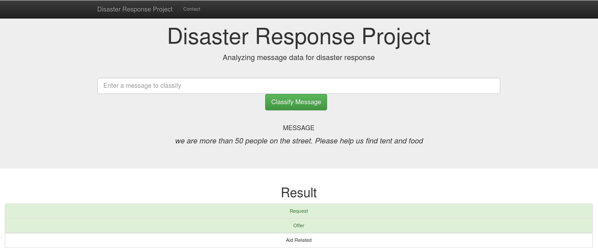

# Disaster Response Project
Machine learning pipeline to categorize messages for disaster response.

### Table of Contents

1. [Project Motivation](#motivation)
2. [File Descriptions](#files)
3. [Web App Screenshot](#screenshot)
4. [Usage](#usage)
5. [Acknowledgements](#acknowledgements)

## Project Motivation 

Following a disaster, typically you get millions of communications right at the time when disaster response organizations have the least capacity to filter and pull out the messages that are the most important for an appropiate response. Different organizations take care of different parts of the problem.
This project involves a web app where you can input a new message and get a classification result in several categories, such as "food", "shelter" and "medical aid". Therefore it serves as a way to classify the information, in order to refer it to the corresponding response organization. The web app also displays a visualization of the data. 

## File Descriptions 

- Data
  - process_data.py: Python script to read in data from the csv files, clean it and store it in a SQL database.
  - messages.csv: Csv file with "id", "message", "original" and "genre" as columns.
  - categories.csv: Csv file with "id" and "categories" as columns.
  - DisasterResponse.db: Database created by process_data.py with cleaned data.
  
- Models
  - train_classifier.py: Python script to load data from the SQL database, train a classification model and save it as a pickle file.

- App
  - run.py: Python script to run the Flask app.
  - templates: HTML templates for the web app.

## Web App Screenshot 

## Usage 
 
- In a terminal navigate to the disaster-response-project and run the following commands:
1. `python data/process_data.py data/messages.csv data/categories.csv data/DisasterResponse.db`
2. `python models/train_classifier.py data/DisasterResponse.db models/classifier.pkl`

- Then navigate to your app's directory and run this command:
4. `python run.py`

- Go to http://0.0.0.0:3001/

## Acknowledgements 

The dataset was provided by [Udacity](https://www.udacity.com/), partnered with [Appen](https://appen.com/), as part of its Data Scientist Nanodegree Program.

